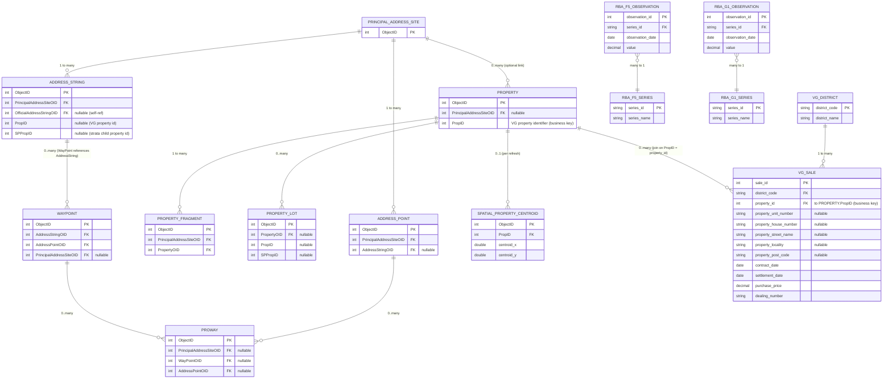

### AddressPoint
A point feature class used to spatially locate an address / AddressString.

| Attribute Name | Data Type | Nulls | Contraints | Description | Source |
|---|---|---:|---|---|---|
| ObjectID | Integer | F | PK |  | [1](#source-1) |
| CreateDate | Date/Time | F |  |  | [1](#source-1) |
| GurasID | Integer | F |  |  | [1](#source-1) |
| PrincipalAddressSiteOID | Integer | F | FK → PrincipalAddressSite.ObjectID |  | [1](#source-1) |
| AddressStringOID | Integer | T | FK → AddressString.ObjectID |  | [1](#source-1) |
| Subtype | Integer | T |  |  | [1](#source-1) |
| AddressPointUncertainty | Double(16,8) | T |  |  | [1](#source-1) |
| Containment | Integer | F | Domain: DmG_Containment |  | [1](#source-1) |

### AddressString
An object class used to store address information (house number, road name, suburb, etc).

| Attribute Name | Data Type | Nulls | Contraints | Description | Source |
|---|---|---:|---|---|---|
| ObjectID | Integer | F | PK |  | [1](#source-1) |
| CreateDate | Date/Time | F |  |  | [1](#source-1) |
| GurasID | Integer | F |  |  | [1](#source-1) |
| AddressType | Integer | F | Domain: DmG_AddressType |  | [1](#source-1) |
| RuralAddress | Integer | T | Domain: DmG_RuralAddress |  | [1](#source-1) |
| PrincipalAddressType | Integer | T | Domain: DmG_PrincipalAddressType |  | [1](#source-1) |
| Subtype | Integer | T |  |  | [1](#source-1) |
| PrincipalAddressSiteOID | Integer | F | FK → PrincipalAddressSite.ObjectID |  | [1](#source-1) |
| OfficialAddressStringOID | Integer | T | FK → AddressString.ObjectID (self-ref) |  | [1](#source-1) |
| RoadSide | Integer | T | Domain: DmG_RoadSide |  | [1](#source-1) |
| HouseNumberFirstPreflix | Char | T |  |  | [1](#source-1) |
| HouseNumberFirst | Integer | T |  |  | [1](#source-1) |
| HouseNumberFirstSuffix | Char | T |  |  | [1](#source-1) |
| HouseNumberSecond | Integer | T |  |  | [1](#source-1) |
| HouseNumberSecondSuffix | Char | T |  |  | [1](#source-1) |
| RoadName | Char | F |  |  | [1](#source-1) |
| RoadType | Char | T |  |  | [1](#source-1) |
| RoadSuffix | Char | T |  |  | [1](#source-1) |
| UnitType | Char | T |  |  | [1](#source-1) |
| UnitNumberPrefix | Char | T |  |  | [1](#source-1) |
| UnitNumber | Integer | T |  |  | [1](#source-1) |
| UnitNumberSuffix | Char | T |  |  | [1](#source-1) |
| LevelType | Char | T |  |  | [1](#source-1) |
| LevelNumberPrefix | Char | T |  |  | [1](#source-1) |
| LevelNumber | Char/Integer | T |  |  | [1](#source-1) |
| LevelNumberSuffix | Char | T |  |  | [1](#source-1) |
| AddressSiteName | Char | T |  |  | [1](#source-1) |
| BuildingName | Char | T |  |  | [1](#source-1) |
| LocationDescription | Char | T |  |  | [1](#source-1) |
| PrivateStreetName | Char | T |  |  | [1](#source-1) |
| PrivateStreetType | Char | T |  |  | [1](#source-1) |
| PrivateStreetSuffix | Char | T |  |  | [1](#source-1) |
| SecondRoadName | Char | T |  |  | [1](#source-1) |
| SecondRoadSuffix | Char | T |  |  | [1](#source-1) |
| SuburbName | Char | T |  |  | [1](#source-1) |
| State | Integer | T | Domain: DmC_State |  | [1](#source-1) |
| Postcode | Integer | T |  |  | [1](#source-1) |
| Council | Char | F |  |  | [1](#source-1) |
| DeliveryPointID | Integer | F |  |  | [1](#source-1) |
| DeliveryPointBarCode | Char | F |  |  | [1](#source-1) |
| AddressConfidence | Integer | F |  |  | [1](#source-1) |
| ContributorOrigin | Integer | T | Domain: DmG_ContributorOrigin |  | [1](#source-1) |
| ContributorID | Char | F |  |  | [1](#source-1) |
| Contributoralignment | Integer/Boolean | T |  |  | [1](#source-1) |
| RouteOID | Integer | F |  |  | [1](#source-1) |
| GNAFPrimarySiteID | Integer | T |  |  | [1](#source-1) |
| Containment | Integer | T | Domain: DmG_Containment |  | [1](#source-1) |
| PropID | Integer | T | FK (soft) → Property.PropID |  | [1](#source-1) |
| SPPropID | Integer | T |  |  | [1](#source-1) |

### PrincipalAddressSite
A logical container for grouping related information for an address site; can contain multiple AddressPoints and AddressStrings and relates to a Property.

| Attribute Name | Data Type | Nulls | Contraints | Description | Source |
|---|---|---:|---|---|---|
| ObjectID | Integer | F | PK |  | [1](#source-1) |
| CreateDate | Date/Time | F |  |  | [1](#source-1) |
| GurasID | Integer | F |  |  | [1](#source-1) |

### Property
A polygon in the NSW Address Database based on property description provided by the Valuer General’s department; properties can be land parcels grouped into valuations.

| Attribute Name | Data Type | Nulls | Contraints | Description | Source |
|---|---|---:|---|---|---|
| ObjectID | Integer | F | PK |  | [1](#source-1) |
| CreateDate | Date/Time | F |  |  | [1](#source-1) |
| GurasID | Integer | F |  |  | [1](#source-1) |
| PrincipalAddressSiteOID | Integer | T | FK → PrincipalAddressSite.ObjectID |  | [1](#source-1) |
| Subtype | Integer | F |  |  | [1](#source-1) |
| ValNetPropertyStatus | Integer | T | Domain: DmG_ValNetPropertyStatus |  | [1](#source-1) |
| ValNetPropertyType | Integer | F | Domain: DmG_ValNetPropertyType |  | [1](#source-1) |
| DissolveParcelCount | Integer | F |  |  | [1](#source-1) |
| ValNetLotCount | Integer | T |  |  | [1](#source-1) |
| ValNetWorkFlowID | Integer | T |  |  | [1](#source-1) |
| PropID | Integer | T | Business key (VG property id) |  | [1](#source-1) |

### PropertyFragment
A spatial polygon with a one-to-one or many-to-one relationship with Property; if a Property is multi-part, each part is represented by a PropertyFragment.

| Attribute Name | Data Type | Nulls | Contraints | Description | Source |
|---|---|---:|---|---|---|
| ObjectID | Integer | F | PK |  | [1](#source-1) |
| CreateDate | Date/Time | F |  |  | [1](#source-1) |
| GurasID | Integer | F |  |  | [1](#source-1) |
| PrincipalAddressSiteOID | Integer | F | FK → PrincipalAddressSite.ObjectID |  | [1](#source-1) |
| PropertyOID | Integer | F | FK → Property.ObjectID |  | [1](#source-1) |

### PropertyLot
Aspatial relationships between the Property feature class and the Lot feature class of the NSW Cadastral database.

| Attribute Name | Data Type | Nulls | Contraints | Description | Source |
|---|---|---:|---|---|---|
| ObjectID | Integer | F | PK |  | [1](#source-1) |
| CreateDate | Date/Time | F |  |  | [1](#source-1) |
| PropertyOID | Integer | T | FK → Property.ObjectID |  | [1](#source-1) |
| PropID | Integer | T |  |  | [1](#source-1) |
| ContributorOrigin | Integer | T | Domain: DmG_ContributorOrigin |  | [1](#source-1) |
| ContributorID | Char | T |  |  | [1](#source-1) |
| CadID | Integer | T |  |  | [1](#source-1) |
| PlanLabel | Char | T |  |  | [1](#source-1) |
| PlanNumber | Integer | T |  |  | [1](#source-1) |
| SectionNumber | Char | T |  |  | [1](#source-1) |
| LotNumber | Char | T |  |  | [1](#source-1) |
| PTLotSecPN | Char | T |  |  | [1](#source-1) |
| SPPropID | Integer | T |  |  | [1](#source-1) |
| PropIDType | Integer | T | Domain: DmG_PropIDType |  | [1](#source-1) |

### Proway
A line that spatially connects the AddressPoint and WayPoint.

| Attribute Name | Data Type | Nulls | Contraints | Description | Source |
|---|---|---:|---|---|---|
| ObjectID | Integer | F | PK |  | [1](#source-1) |
| CreateDate | Date/Time | F |  |  | [1](#source-1) |
| GurasID | Integer | F |  |  | [1](#source-1) |
| PrincipalAddressSiteOID | Integer | T | FK → PrincipalAddressSite.ObjectID |  | [1](#source-1) |
| WayPointOID | Integer | T | FK → WayPoint.ObjectID |  | [1](#source-1) |
| AddressPointOID | Integer | T | FK → AddressPoint.ObjectID |  | [1](#source-1) |
| Subtype | Integer | F |  |  | [1](#source-1) |

### Spatial_Property_Centroid
A small helper table created from the Spatial Services FeatureServer query response (per PropID), capturing the returned centroid coordinates for a unit block. This is useful for modelling features without repeatedly calling the API.

| Attribute Name | Data Type | Nulls | Contraints | Description | Source |
|---|---|---:|---|---|---|
| ObjectID | Integer | F | PK |  | [1](#source-1) |
| PropID | Integer | F | FK → Property.PropID (business key) |  | [1](#source-1) |
| centroid_x | Double | F |  |  | [1](#source-1) |
| centroid_y | Double | F |  |  | [1](#source-1) |
| spatial_reference | Char | T |  |  | [1](#source-1) |
| extracted_at | Date/Time | F |  |  | [1](#source-1) |

### RBA_F5_Indicator_Lending_Rates
Time series features for modelling. You said you only care about **Series ID** and **FILRHLBVS**, but you’ll almost certainly want the observation date too. FILRHLBVS expands to: “Lending rates; Housing loans; Banks; Variable; Standard; Owner-occupier”.

| Attribute Name | Data Type | Nulls | Contraints | Description | Source |
|---|---|---:|---|---|---|
| ObjectID | Integer | F | PK |  | [3](#source-3) |
| Series_ID | Char | F |  |  | [3](#source-3) |
| ObservationDate | Date | F |  |  | [3](#source-3) |
| FILRHLBVS | Decimal | F | Lending rates; Housing loans; Banks; Variable; Standard; Owner-occupier | [3](#source-3) |

### RBA_G1_CPI
CPI features for modelling. Suggested columns: **GCPIAG** (CPI, all groups index) and **GCPIAGQP** (CPI, all groups quarterly % change). Keep others if you want later (e.g., different inflation measures), but these two match your use-case.

| Attribute Name | Data Type | Nulls | Contraints | Description | Source |
|---|---|---:|---|---|---|
| ObjectID | Integer | F | PK |  | [3](#source-3) |
| Series_ID | Char | F |  |  | [3](#source-3) |
| ObservationDate | Date | F |  |  | [3](#source-3) |
| GCPIAG | Decimal | T |  |  | [3](#source-3) |
| GCPIAGQP | Decimal | T |  |  | [3](#source-3) |

### VG_District
Lookup table limiting sales data to your target districts (090 Ryde, 139 Canada Bay, 260 City of Parramatta).

| Attribute Name | Data Type | Nulls | Contraints | Description | Source |
|---|---|---:|---|---|---|
| district_code | Char(3) | F | PK |  | [2](#source-2) |
| district_name | Char | F |  |  | [4](#source-4) |

### VG_Sale
Sales facts per unit (or per property where unit details are absent). Notes:
- Not every Spatial property will have a matching sale in your period.
- Some properties change use/type over time (e.g., redevelopment into a unit block) so a Spatial property may “appear” later than earlier sales data.
- Some VG fields can be blank for units (you mentioned **area** often blank).

| Attribute Name | Data Type | Nulls | Contraints | Description | Source |
|---|---|---:|---|---|---|
| sale_id | Integer | F | PK |  | [2](#source-2) |
| district_code | Char(3) | F | FK → VG_District.district_code |  | [2](#source-2) |
| property_id | Integer | F | FK (soft) → Property.PropID |  | [2](#source-2) |
| sale_counter | Char | F | Unique within file |  | [2](#source-2) |
| download_datetime | Date/Time | F |  |  | [2](#source-2) |
| property_name | Char | T |  |  | [2](#source-2) |
| property_unit_number | Char | T |  |  | [2](#source-2) |
| property_house_number | Char | T |  |  | [2](#source-2) |
| property_street_name | Char | T |  |  | [2](#source-2) |
| property_locality | Char | T |  |  | [2](#source-2) |
| property_post_code | Char | T |  |  | [2](#source-2) |
| area | Decimal(7,3) | T |  |  | [2](#source-2) |
| area_type | Char(1) | T | M=sqm, H=ha |  | [2](#source-2) |
| contract_date | Date | F | CCYYMMDD |  | [2](#source-2) |
| settlement_date | Date | F | CCYYMMDD |  | [2](#source-2) |
| purchase_price | Decimal | F |  |  | [2](#source-2) |
| zoning | Char | T |  |  | [2](#source-2) |
| nature_of_property | Char(1) | T | V=Vacant, R=Residence, 3=Other |  | [2](#source-2) |
| primary_purpose | Char | T | When nature_of_property=3 |  | [2](#source-2) |
| strata_lot_number | Char | T |  |  | [2](#source-2) |
| component_code | Char | T |  |  | [2](#source-2) |
| sale_code | Char | T |  |  | [2](#source-2) |
| interest_percent | Char | T | Null if 100% |  | [2](#source-2) |
| dealing_number | Char | F |  |  | [2](#source-2) |
| property_legal_description | Char | T | Concatenated from Record C (may span multiple records) |  | [2](#source-2) |

---

## Sources
- [1] NSW Spatial Services – NSW Addressing Data Dictionary (NSW Geocoded Address Theme / Property Theme).
- [2] NSW Valuer General – Current Property Sales Data File Format (2001–current) (Record B/C definitions).
- [3] Reserve Bank of Australia (RBA) Statistical Tables (CSV): F5 (Indicator Lending Rates) and G1 (Consumer Price Inflation).
- [4] User-defined mapping: district codes (090/139/260) → (Ryde/Canada Bay/City of Parramatta).
