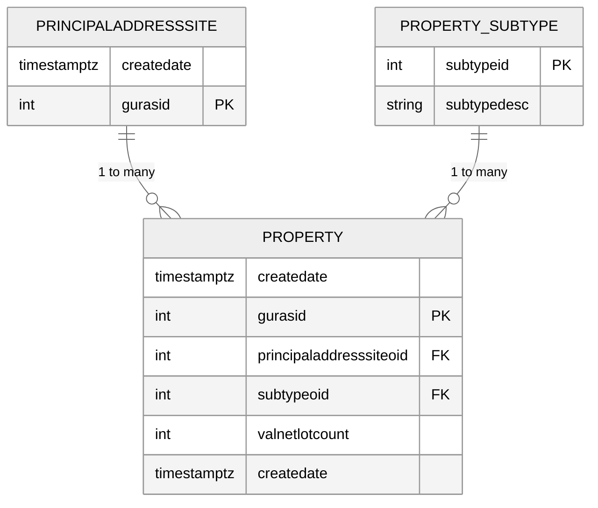

```mermaid
%%{init: {"theme":"neutral","erDiagram":{"diagramPadding":24}}}%%
erDiagram
  PRINCIPALADDRESSSITE ||--o{ PROPERTY : "1 to many"
  PROPERTY_SUBTYPE ||--o{ PROPERTY : "1 to many"

  PRINCIPALADDRESSSITE {
    timestamptz createdate
    int gurasid PK
  }

  PROPERTY {
    timestamptz createdate
    int gurasid PK
    int principaladdresssiteoid FK
    int subtypeoid FK
    int valnetlotcount 
    timestamptz createdate
  }
  PROPERTY_SUBTYPE {
    int subtypeid PK
    string subtypedesc
  }

```
### PROPERTY_SUBTYPE
| **subtypeid** | **subtypedesc** |
| --- | --- |
| 1 | Property |
| 2 | Crown |
| 3 | National Park |
| 4 | State Forest |
| 5 | Other |
| 6 | Incomplete |